### Objectifs

1.  Tracer des graphiques en utilisant
    [matplotlib](https://matplotlib.org/api/pyplot_api.html)
2.  Lecture et tracé d\'histogrammes d\'images.
3.  Travailler avec les algorithmes de [regroupement](http://scikit-learn.org/stable/modules/clustering.html)
    et [classification](http://scikit-learn.org/stable/modules/svm.html)


#### Exercise 2.1 \[★\]

[matplotlib](https://matplotlib.org/api/pyplot_api.html) peut être utilisé pour tracer des graphiques. Voici un code très simple avec seulement valeurs x. Après avoir importé la bibliothèque *matplotlib*, nous initialisons les valeurs x et les traçons.


``` 
               
import matplotlib.pyplot as plot
x = [1, 2, 3, 4, 5, 6, 7, 8, 9, 10]
plot.plot(x)
plot.show()
               
              

```


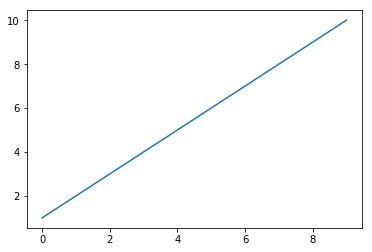


Changeons maintenant la couleur, le style et la largeur de la ligne.


``` 
import matplotlib.pyplot as plot
x = [1, 2, 3, 4, 5, 6, 7, 8, 9, 10]
plot.plot(x, linewidth=3, drawstyle="steps", color="#00363a")
plot.show()
```


Nous allons maintenant initialiser les valeurs y et tracer le graphique.


``` 
import matplotlib.pyplot as plot
x = [1, 2, 3, 4, 5, 6, 7, 8, 9, 10]
y = [0, 1, 0, 0, 1, 0, 1, 1, 1, 0]
plot.plot(x, y, linewidth=3, drawstyle="steps", color="#00363a")
plot.show()
               
```


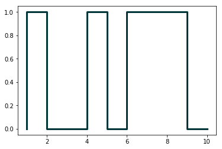


Dans la [première session pratique](../TP1/tp1.ipynb), nous avons vu comment analyser les fichiers JSON. En continuant avec le même fichier [JSON](../../data/pl.json), nous allons maintenant tracer les résultats
du nombre de langages de programmation publiés par an. Vérifiez la sortie.


``` 
from pandas import json_normalize
import pandas as pd
import json
import matplotlib.pyplot as plot
data = json.load(open('../../data/pl.json'))
dataframe = json_normalize(data)
grouped = dataframe.groupby('year').count()
plot.plot(grouped)
plot.show()
```


Le programme suivant ajoutera le titre et les étiquettes à l\'axe des x et à l\'axe des y.


``` 
from pandas import json_normalize
import pandas as pd
import json
import matplotlib.pyplot as plot
data = json.load(open('../../data/pl.json'))
dataframe = json_normalize(data)
grouped = dataframe.groupby('year').count()
plot.plot(grouped)
plot.title("Programming languages per year")
plot.xlabel('year',  fontsize=16)
plot.ylabel('count',  fontsize=16)
plot.show()
```


Il existe encore une autre façon de tracer les \'dataframes\', en utilisant
[pandas.DataFrame.plot](https://pandas.pydata.org/pandas-docs/stable/generated/pandas.DataFrame.plot.html).


``` 
from pandas import json_normalize
import pandas as pd
import json
import matplotlib.pyplot as plot
data = json.load(open('../../data/pl.json'))
dataframe = json_normalize(data)
grouped = dataframe.groupby('year').count()
grouped = grouped.rename(
  columns={'languageLabel':'count'}).reset_index()
grouped.plot(x=0, kind='bar', title="Programming languages per year")
```


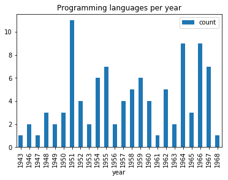
Maintenant, nous voulons créer plusieurs sous-images. Une méthode simple est donnée ci-dessous.
Rappelons que lors de la [première session pratique](../TP1/tp1.ipynb), nous avons regroupé par
sur plusieurs colonnes. Des sous-parcelles peuvent être utilisées pour visualiser ces données.


``` 
from pandas.io.json import json_normalize
import pandas as pd
import json
import math
import matplotlib.pyplot as plot
jsondata = json.load(open('../../data/plparadigm.json'))
array = []
for data in jsondata:
    array.append([data['year'], data['languageLabel'],
      data['paradigmLabel']])
dataframe = pd.DataFrame(array, columns=['year', 'languageLabel',
      'paradigmLabel'])
dataframe = dataframe.astype(dtype= {"year" : "int64",
      "languageLabel" : "<U200",
      "paradigmLabel" : "<U200"})
grouped = dataframe.groupby(['paradigmLabel', 'year']).count()
grouped = grouped.rename(columns={'languageLabel':'count'})
grouped = grouped.groupby(['paradigmLabel'])
#Initialization of subplots
nr = math.ceil(grouped.ngroups/2)
fig, axes = plot.subplots(nrows=nr, ncols=2, figsize=(20,25))
#Creation of subplots
for i, group in enumerate(grouped.groups.keys()):
    g = grouped.get_group(group).reset_index()
    g.plot(x='year', y='count', kind='bar',
    title=group, ax=axes[math.floor(i/2),i%2])
plot.show()
               
              

```


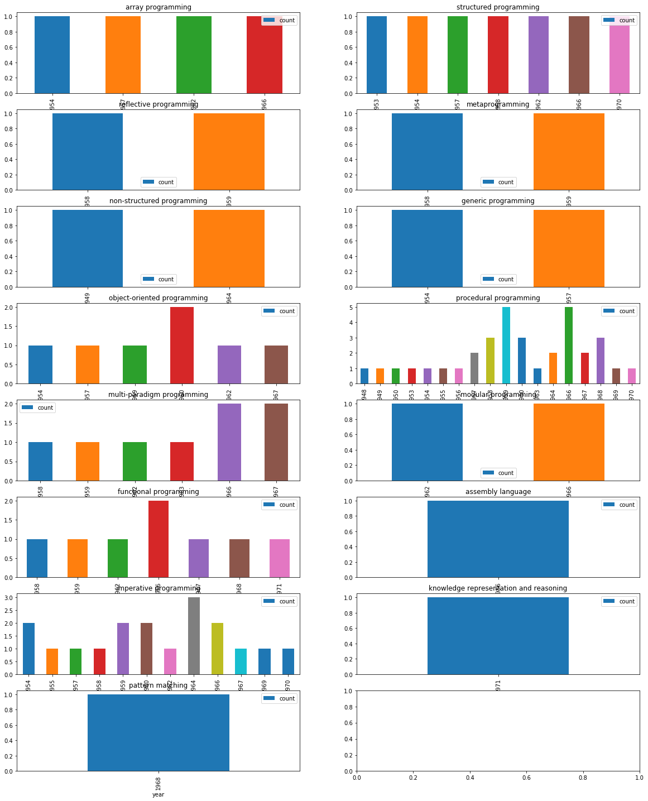
Modifiez le code ci-dessus, afin que nous puissions obtenir des informations visuelles sur le nombre de langages de différents paradigmes de programmation publiés au cours de chaque année disponible, c\'est-à-dire que pour chaque année, nous voulons voir le nombre de langages de programmation appartenant à chaque paradigme de langage de programmation.


#### Exercice 2.2 \[★\]

Dans cet exercice, nous allons travailler sur les images. Téléchargez une image (par ex,
[image.bmp](../../images/picture.bmp) et [flower.jpg](../../images/flower.jpg)) dans votre version actuelle
et l\'ouvrir de la manière suivante. Nous allons d\'abord essayer d\'obtenir quelques métadonnées de l\'image.


``` 
import os,sys
from PIL import Image
imgfile = Image.open("../../images/picture.bmp")
print(imgfile.size, imgfile.format)
```


Nous utilison le module \'Image\' de Python PIL
([Documentation](http://www.effbot.org/imagingbook/image.htm)). Nous allons essayez maintenant d\'obtenir des données de 100 pixels à partir d\'une image.


``` 
import os,sys
from PIL import Image
imgfile = Image.open("../../images/flower.jpg")
data = imgfile.getdata()
for i in range(10):
    for j in range(10):
        print(i,j, data.getpixel((i,j)))
```


Vous pouvez remarquer la position et les valeurs des pixels (un tuple de 3 valeurs). Essayons d\'obtenir des métadonnées supplémentaires sur les images, c\'est-à-dire le mode de l\'image (par exemple, RGB)), le nombre de bandes, le nombre de bits pour chaque bande, la largeur et la hauteur de l\'image (en pixels).


``` 
import os,sys
from PIL import Image
imgfile = Image.open("../../images/flower.jpg")
print(imgfile.mode, imgfile.getbands(), imgfile.bits,
  imgfile.width, imgfile.height)
              
             

```


Obtenons maintenant un histogramme des couleurs. Lorsque vous exécutez le code suivant, vous obtenez un tableau unique de valeurs, la fréquence de chaque bande (R, G, B etc.) concaténée ensemble. Dans le code suivant, nous supposerons que nous travaillons avec une image de 3 bandes (mode RGB) et que chaque bande est représentée par 8 bits. Nous allons tracer le [histogramme](http://www.effbot.org/imagingbook/image.htm#tag-Image.Image.histogram) de différentes couleurs.


``` 
from PIL import Image
import matplotlib.pyplot as plot
imgfile = Image.open("../../images/flower.jpg")
histogram = imgfile.histogram()
# we have three bands (for this image)
red = histogram[0:255]
green = histogram[256:511]
blue = histogram[512:767]
fig, (axis1, axis2, axis3) = plot.subplots(nrows=3, ncols=1)
axis1.plot(red, color='red')
axis2.plot(green, color='green')
axis3.plot(blue, color='blue')
plot.show()
               
              

```


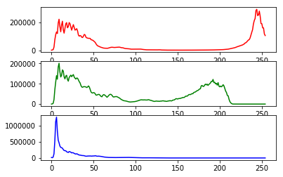
Mais si vous souhaitez les voir tous dans une seule image.


``` 
from PIL import Image
import matplotlib.pyplot as plot
imgfile = Image.open("../../images/flower.jpg")
histogram = imgfile.histogram()
red = histogram[0:255]
green = histogram[256:511]
blue = histogram[512:767]
x=range(255)
y = []
for i in x:
    y.append((red[i],green[i],blue[i]))
plot.plot(x,y)
plot.show()
```


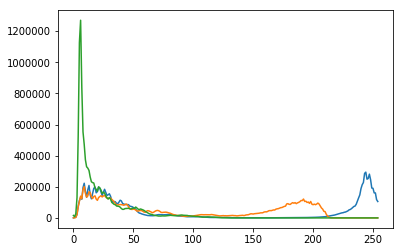
Mais nous ne voulons pas perdre les couleurs de la bande.


``` 
from PIL import Image
import matplotlib.pyplot as plot
imgfile = Image.open("../../images/flower.jpg")
histogram = imgfile.histogram()
red = histogram[0:255]
green = histogram[256:511]
blue = histogram[512:767]
x=range(255)
y = []
for i in x:
    y.append((red[i],green[i],blue[i]))
figure, axes = plot.subplots()
axes.set_prop_cycle('color', ['red', 'green', 'blue'])
plot.plot(x,y)
plot.show()
```


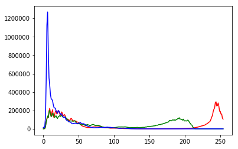
Votre prochaine question consiste à obtenir les 20 premières intensités dans chaque bande et à créer un seul tracé de ces premières intensités. Écrivez un programme python qui peut réaliser cela.


#### Exercice 2.3 \[★★\]

Dans cet exercice, nous examinerons [Algorithme de regroupement KMeans](http://scikit-learn.org/stable/modules/generated/sklearn.cluster.KMeans.html).
En continuant avec les images, nous allons maintenant trouver 4 couleurs prédominantes dans une image.


``` 
from PIL import Image
import numpy
import math
import matplotlib.pyplot as plot
from sklearn.cluster import KMeans
imgfile = Image.open("../../images/flower.jpg")
numarray = numpy.array(imgfile.getdata(), numpy.uint8)
clusters = KMeans(n_clusters = 4)
clusters.fit(numarray)
npbins = numpy.arange(0, 5)
histogram = numpy.histogram(clusters.labels_, bins=npbins)
labels = numpy.unique(clusters.labels_)
barlist = plot.bar(labels, histogram[0])
for i in range(4):
    barlist[i].set_color('#%02x%02x%02x' % (
    math.ceil(clusters.cluster_centers_[i][0]), 
        math.ceil(clusters.cluster_centers_[i][1]),
    math.ceil(clusters.cluster_centers_[i][2])))
plot.show()
```


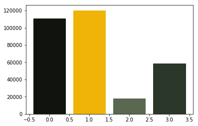
Pour votre prochaine question, votre objectif est de comprendre le code ci-dessus et
réaliser ce qui suit :

1.  Supposer que le nombre de grappes est donné par l\'utilisateur, généraliser
    le code ci-dessus.
2.  En cas de diagramme à barres, assurez-vous que les barres sont disposées dans le
    ordre décroissant de la fréquence des couleurs.
3.  Ajoutez également le support pour le graphique circulaire en plus du graphique en barres. Assurez-vous que
    que nous utilisons les couleurs de l\'image comme les couleurs de la tranche.
4.  Avez-vous des observations intéressantes ?
    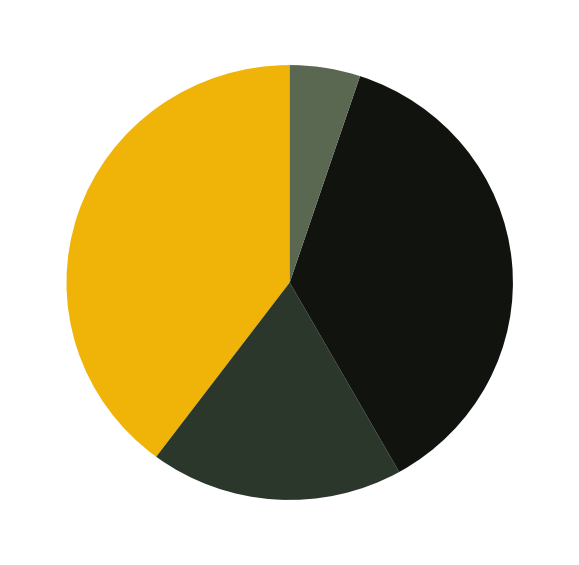


#### Exercise 2.4 \[★★\]

Nous allons essayer d\'obtenir plus de clusters et de vérifier le temps pris par chacun de ces algorithmes.
Commençons par quelques exercices très simples pour expérimenter l\'algorithme KMeans. Considérez les données suivantes et visualisez-les sur un nuage de points à l\'aide d\'un diagramme de dispersion.


``` 
import numpy as np
import matplotlib.pyplot as plot

numarray = np.array([[1, 1], [1, 2], [1, 3], [1, 4], [1, 5], 
 [1, 6], [1, 7], [1, 8],[1, 9], [1, 10], 
 [10, 1], [10, 2], [10, 3], [10, 4], [10, 5], 
 [10, 6], [10, 7], [10, 8],[10, 9], [10, 10]])

plot.scatter(numarray[:, 0], numarray[:, 1])
plot.show()

```


Visuellement, il est assez évident qu\'il y a deux groupes. Mais utilisons l\'algorithme KMeans pour obtenir les 2 clusters. Nous allons d\'abord voir les étiquettes de nos données regroupées.


``` 
import numpy as np
import matplotlib.pyplot as plot
from sklearn.cluster import KMeans

numarray = np.array([[1, 1], [1, 2], [1, 3], [1, 4], [1, 5], 
 [1, 6], [1, 7], [1, 8],[1, 9], [1, 10], 
 [10, 1], [10, 2], [10, 3], [10, 4], [10, 5], 
 [10, 6], [10, 7], [10, 8],[10, 9], [10, 10]])

clusters = KMeans(n_clusters = 2)
clusters.fit(numarray)
print(clusters.labels_)
```


Maintenant, nous allons visualiser les groupes à l\'aide d\'un nuage de points. Nous utiliserons
deux couleurs pour les distinguer visuellement.


``` 
import numpy as np
import matplotlib.pyplot as plot
from sklearn.cluster import KMeans

numarray = np.array([[1, 1], [1, 2], [1, 3], [1, 4], [1, 5], 
 [1, 6], [1, 7], [1, 8],[1, 9], [1, 10], 
 [10, 1], [10, 2], [10, 3], [10, 4], [10, 5], 
 [10, 6], [10, 7], [10, 8],[10, 9], [10, 10]])
    
clusters = KMeans(n_clusters = 2)
clusters.fit(numarray)
colors = np.array(["#ff0000", "#00ff00"])
        
plot.scatter(numarray[:, 0], numarray[:, 1], c=colors[clusters.labels_])
plot.show()

```


Et si nous essayions d\'obtenir 4 clusters ? Essayez d\'exécuter le code suivant, plusieurs fois. Des observations ? Essayez de changer la valeur de *n_init* avec des valeurs plus élevées.


``` 
import numpy as np
import matplotlib.pyplot as plot
from sklearn.cluster import KMeans

numarray = np.array([[1, 1], [1, 2], [1, 3], [1, 4], [1, 5], 
 [1, 6], [1, 7], [1, 8],[1, 9], [1, 10], 
 [10, 1], [10, 2], [10, 3], [10, 4], [10, 5], 
 [10, 6], [10, 7], [10, 8],[10, 9], [10, 10]])
    
clusters = KMeans(n_clusters = 4, n_init=2)
clusters.fit(numarray)
colors = np.array(["#ff0000", "#00ff00", "#0000ff", "#ffff00"])
        
plot.scatter(numarray[:, 0], numarray[:, 1], c=colors[clusters.labels_])
plot.show()
```


Nous allons maintenant essayer d\'obtenir des clusters avec des données réelles (référence : [citypopulation.json](../../data/citypopulation.json), Source : Wikidata). Il contient des informations concernant différentes villes du monde : nom de la ville, année de sa fondation et sa population en l\'année 2010. Dans le code suivant, nous voulons regrouper les données sur la population et d\'observer s\'il y a une corrélation entre l\'âge et la les statistiques de la population (2010). Dans le code suivant, il y a un ligne commentée. Vous pouvez le décommenter pour essayer avec une population différente les chiffres. Des observations ? Pourquoi avons-nous utilisé LabelEncoder ? Quelle est sa but ?


``` 
from pandas import json_normalize
from sklearn.preprocessing import LabelEncoder
import pandas as pd
import json
data = json.load(open('../../data/citypopulation.json'))
dataframe = json_normalize(data)
le = LabelEncoder()
dataframe['cityLabel'] = le.fit_transform(dataframe['cityLabel'])
dataframe = dataframe.astype(dtype= {"year":"<i4",
"cityLabel":"<U200", "population":"i"})
dataframe = dataframe.loc[dataframe['year'] > 1500]
#dataframe = dataframe.loc[dataframe['population'] < 700000]
yearPopulation = dataframe[['year', 'population']]
clusters = KMeans(n_clusters = 2, n_init=1000)
clusters.fit(yearPopulation.values)
colors = np.array(["#ff0000", "#00ff00", "#0000ff", "#ffff00"])
   
plot.rcParams['figure.figsize'] = [10, 10]
plot.scatter(yearPopulation['year'], yearPopulation['population'],
      c=colors[clusters.labels_])
plot.show()
```


Maintenant, continuons à travailler avec [flower.jpg](../../images/flower.jpg). Recommençons avec **KMeans** et essayons d\'obtenir des groupes de taille comprise entre 2 et 11.


``` 
from PIL import Image
import numpy
import math
import matplotlib.pyplot as plot
from sklearn.cluster import KMeans
imgfile = Image.open("../../images/flower.jpg")
numarray = numpy.array(imgfile.getdata(), numpy.uint8)
X = []
Y = []
fig, axes = plot.subplots(nrows=5, ncols=2, figsize=(20,25))
xaxis = 0
yaxis = 0
for x in range(2, 12):
    cluster_count = x 
    
    clusters = KMeans(n_clusters = cluster_count)
    clusters.fit(numarray)
    
    npbins = numpy.arange(0, cluster_count + 1)
    histogram = numpy.histogram(clusters.labels_, bins=npbins)
    labels = numpy.unique(clusters.labels_)
    barlist = axes[xaxis, yaxis].bar(labels, histogram[0])
    if(yaxis == 0):
        yaxis = 1
    else:
        xaxis = xaxis + 1
        yaxis = 0
    for i in range(cluster_count):
        barlist[i].set_color('#%02x%02x%02x' % (
        math.ceil(clusters.cluster_centers_[i][0]),
            math.ceil(clusters.cluster_centers_[i][1]), 
        math.ceil(clusters.cluster_centers_[i][2])))
plot.show()
```


Votre prochain objectif est de tester le code ci-dessus pour les tailles de grappes entre 2 et 21, ce qui vous donnera le chiffre indiqué ci-dessous.

**Note:** L\'image suivante a été générée après 6 minutes.

En option, vous pouvez ajouter des déclarations *print* pour tester si votre code fonctionne bien.

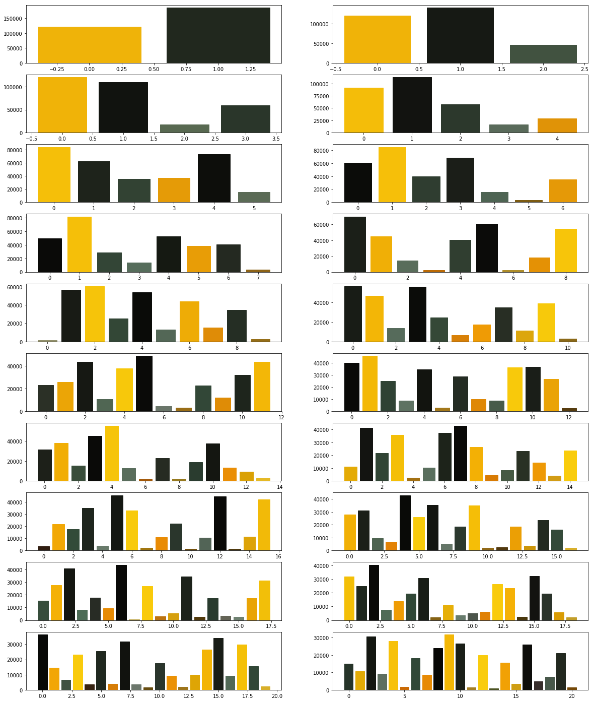
Now we modify the above algorithm to use **MiniBatchKMeans** clustering
algorithm (refer
[here](http://scikit-learn.org/stable/modules/clustering.html#mini-batch-kmeans)).
Observez les changements.


``` 
from PIL import Image
import numpy
import math
import matplotlib.pyplot as plot
from sklearn.cluster import MiniBatchKMeans
imgfile = Image.open("../../images/flower.jpg")
numarray = numpy.array(imgfile.getdata(), numpy.uint8)
X = []
Y = []
fig, axes = plot.subplots(nrows=5, ncols=2, figsize=(20,25))
xaxis = 0
yaxis = 0
for x in range(2, 12):
    cluster_count = x 
    
    clusters = MiniBatchKMeans(n_clusters = cluster_count)
    clusters.fit(numarray)
    
    npbins = numpy.arange(0, cluster_count + 1)
    histogram = numpy.histogram(clusters.labels_, bins=npbins)
    labels = numpy.unique(clusters.labels_)
    barlist = axes[xaxis, yaxis].bar(labels, histogram[0])
    if(yaxis == 0):
        yaxis = 1
    else:
        xaxis = xaxis + 1
        yaxis = 0
    for i in range(cluster_count):
        barlist[i].set_color('#%02x%02x%02x' % (
        math.ceil(clusters.cluster_centers_[i][0]),
            math.ceil(clusters.cluster_centers_[i][1]), 
        math.ceil(clusters.cluster_centers_[i][2])))
plot.show()
```


What did you observe? Your next goal is to test the above code for cluster sizes between 2 and 21 which will give you the figure given below.

What are your conclusions?

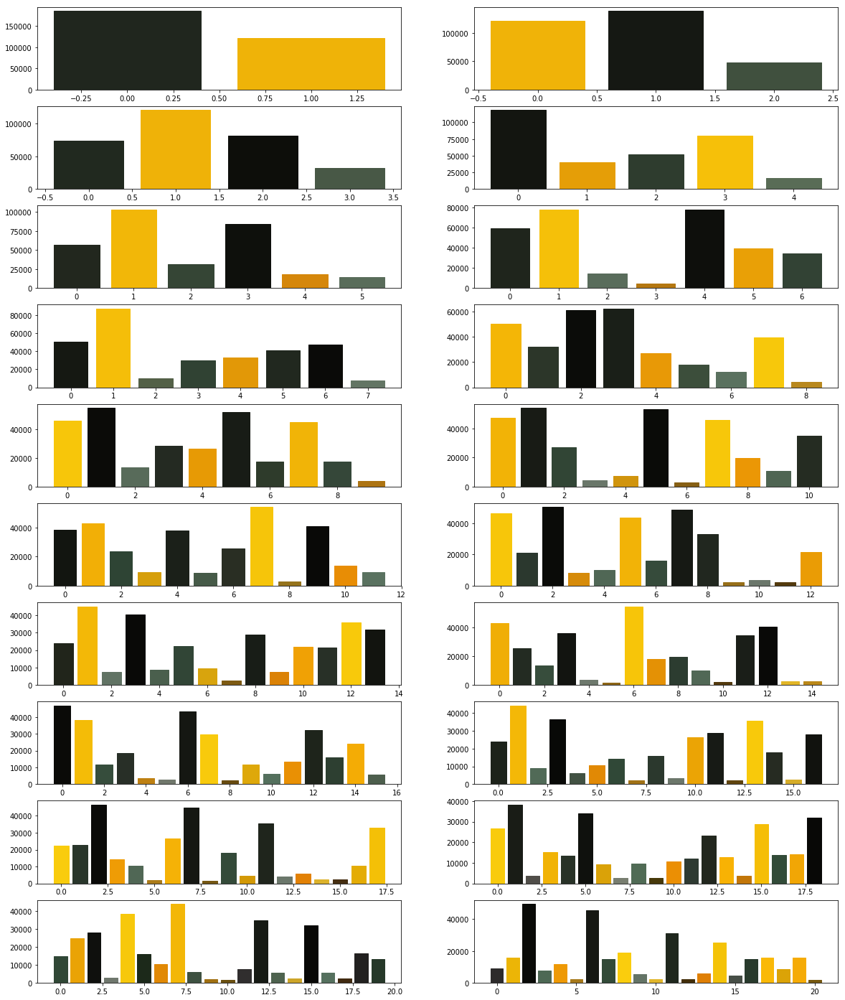
Afin de comparer les deux algorithmes, nous considérons le temps pris par chacun de ces algorithmes. Nous allons répéter l\'expérience ci-dessus, mais cette fois nous allons tracer le temps nécessaire pour obtenir des grappes de tailles différentes.

Nous commençons par **KMeans**.


``` 
from PIL import Image
import numpy
import math
import time
import matplotlib.pyplot as plot
from sklearn.cluster import KMeans
imgfile = Image.open("../../images/flower.jpg")
numarray = numpy.array(imgfile.getdata(), numpy.uint8)
X = []
Y = []
for x in range(1, 20):
    cluster_count = x 
    
    start_time = time.time()
    clusters = KMeans(n_clusters = cluster_count)
    clusters.fit(numarray)
    end_time = time.time()
    total_time = end_time - start_time
    print("Total time: ", x, ":", total_time)
    X.append(x)
    Y.append(total_time)
plot.bar(X, Y)
plot.show()
```


Vous pouvez obtenir un graphique similaire à celui qui suit.
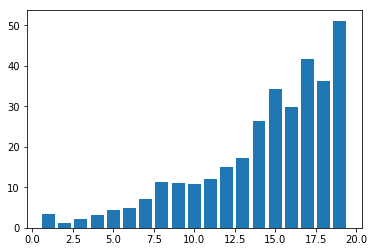

Nous utilisons maintenant **MiniBatchKMeans**.


``` 
from PIL import Image
import numpy
import math
import time
import matplotlib.pyplot as plot
from sklearn.cluster import MiniBatchKMeans
imgfile = Image.open("../../images/flower.jpg")
numarray = numpy.array(imgfile.getdata(), numpy.uint8)
X = []
Y = []
for x in range(1, 20):
    cluster_count = x 
    
    start_time = time.time()
    clusters = MiniBatchKMeans(n_clusters = cluster_count)
    clusters.fit(numarray)
    end_time = time.time()
    total_time = end_time - start_time
    print("Total time: ", x, ":", total_time)
    X.append(x)
    Y.append(total_time)
plot.bar(X, Y)
plot.show()
```


Vous pouvez obtenir un graphique similaire à celui qui suit.

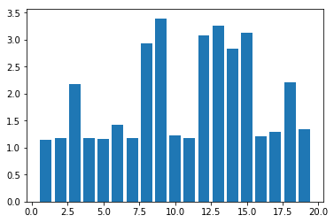

Testez maintenant le code ci-dessus en utilisant l\'algorithme **MiniBatchKMeans** avec des tailles de grappes entre 2 et 50. Quelles sont vos observations ?

Enfin, nous voulons voir si nous obtenons les mêmes centres de grappes à partir des deux algorithmes. Lancez le programme suivant pour voir les centres de grappes produits par les deux algorithmes. Nous utilisons deux couleurs différentes (rouge et noir) pour distinguer les centres de grappes des deux algorithmes.


``` 
from PIL import Image
import numpy
import math
import matplotlib.pyplot as plot
from sklearn.cluster import KMeans
from sklearn.cluster import MiniBatchKMeans

imgfile = Image.open("../../images/flower.jpg")
numarray = numpy.array(imgfile.getdata(), numpy.uint8)

cluster_count = 10

clusters = KMeans(n_clusters = cluster_count)
clusters.fit(numarray)

mclusters = MiniBatchKMeans(n_clusters = cluster_count)
mclusters.fit(numarray)

fig, axes = plot.subplots(nrows=3, ncols=1, figsize=(20,25))
#Scatter plot for RG (RGB)
axes[0].scatter(numarray[:,0],numarray[:,1])
axes[0].scatter(clusters.cluster_centers_[:,0],
            clusters.cluster_centers_[:,1], c='red')
axes[0].scatter(mclusters.cluster_centers_[:,0],
            mclusters.cluster_centers_[:,1], c='black')

#Scatter plot of RB (RGB)
axes[1].scatter(numarray[:,0],numarray[:,2])
axes[1].scatter(clusters.cluster_centers_[:,0],
            clusters.cluster_centers_[:,2], c='red')
axes[1].scatter(mclusters.cluster_centers_[:,0],
            mclusters.cluster_centers_[:,2], c='black')

#Scatter plot of GB (RGB)
axes[2].scatter(numarray[:,1],numarray[:,2])
axes[2].scatter(clusters.cluster_centers_[:,1],
            clusters.cluster_centers_[:,2], c='red')
axes[2].scatter(mclusters.cluster_centers_[:,1],
            mclusters.cluster_centers_[:,2], c='black')
```


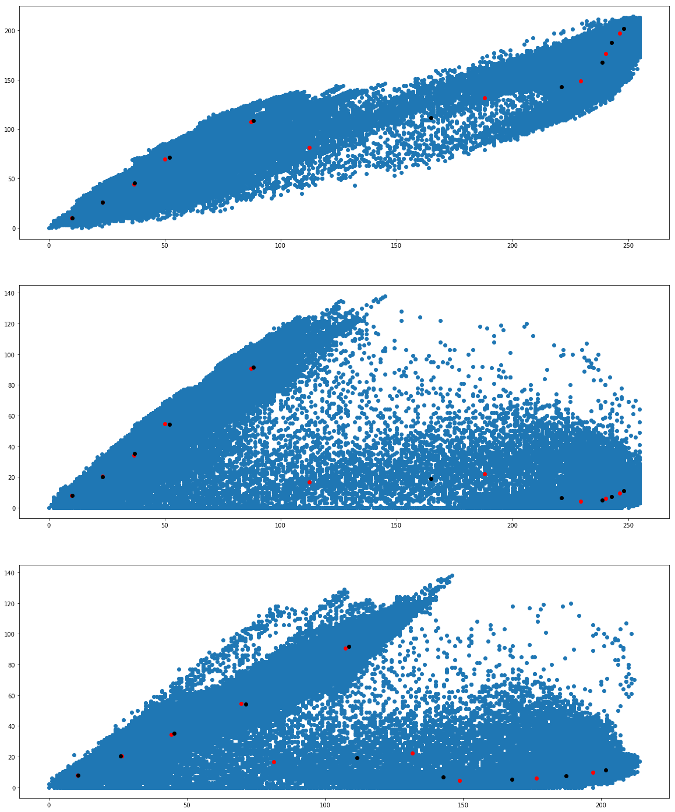

Nous aimerions voir comment les valeurs des pixels individuels ont été regroupées. Exécutez le programme suivant quelques fois.


``` 
from PIL import Image
import numpy
import math
import time
import matplotlib.pyplot as plot
from sklearn.cluster import KMeans
from sklearn.cluster import MiniBatchKMeans

imgfile = Image.open("../../images/flower.jpg")
numarray = numpy.array(imgfile.getdata(), numpy.uint8)

cluster_count = 10

mclusters = MiniBatchKMeans(n_clusters = cluster_count)
mclusters.fit(numarray)

npbins = numpy.arange(0, cluster_count + 1)
histogram = numpy.histogram(mclusters.labels_, bins=npbins)
labels = numpy.unique(mclusters.labels_)

fig, axes = plot.subplots(nrows=3, ncols=2, figsize=(20,25))

#Scatter plot for RG (RGB)
colors = []
for i in range(len(numarray)):
    j = mclusters.labels_[i]
    colors.append('#%02x%02x%02x' % (
       math.ceil(mclusters.cluster_centers_[j][0]),
           math.ceil(mclusters.cluster_centers_[j][1]), 0))
                  
axes[0,0].scatter(numarray[:,0],numarray[:,1], c=colors)
axes[0,0].scatter(mclusters.cluster_centers_[:,0],
              mclusters.cluster_centers_[:,1], marker="+", c='red')

#Scatter plot for RB (RGB)
colors = []
for i in range(len(numarray)):
    j = mclusters.labels_[i]
    colors.append('#%02x%02x%02x' % (
       math.ceil(mclusters.cluster_centers_[j][0]),
           0, math.ceil(mclusters.cluster_centers_[j][2])))
                  
axes[1,0].scatter(numarray[:,0],numarray[:,2], c=colors)
axes[1,0].scatter(mclusters.cluster_centers_[:,0],
           mclusters.cluster_centers_[:,2], marker="+", c='white')

#Scatter plot for GB (RGB)
colors = []
for i in range(len(numarray)):
    j = mclusters.labels_[i]
    colors.append('#%02x%02x%02x' % (0, 
       math.ceil(mclusters.cluster_centers_[j][1]),
            math.ceil(mclusters.cluster_centers_[j][2])))
                  
axes[2,0].scatter(numarray[:,1],numarray[:,2], c=colors)
axes[2,0].scatter(mclusters.cluster_centers_[:,1],
      mclusters.cluster_centers_[:,2], marker="+", c='yellow')

clusters = KMeans(n_clusters = cluster_count)
clusters.fit(numarray)

npbins = numpy.arange(0, cluster_count + 1)
histogram = numpy.histogram(clusters.labels_, bins=npbins)
labels = numpy.unique(clusters.labels_)

#Scatter plot for RG (RGB)
colors = []
for i in range(len(numarray)):
    j = clusters.labels_[i]
    colors.append('#%02x%02x%02x' % (
       math.ceil(clusters.cluster_centers_[j][0]),
           math.ceil(clusters.cluster_centers_[j][1]), 0))
                  
axes[0,1].scatter(numarray[:,0],numarray[:,1], c=colors)
axes[0,1].scatter(clusters.cluster_centers_[:,0],
              clusters.cluster_centers_[:,1], marker="+", c='red')

#Scatter plot for RB (RGB)
colors = []
for i in range(len(numarray)):
    j = clusters.labels_[i]
    colors.append('#%02x%02x%02x' % (
       math.ceil(clusters.cluster_centers_[j][0]),
           0, math.ceil(clusters.cluster_centers_[j][2])))
                  
axes[1,1].scatter(numarray[:,0],numarray[:,2], c=colors)
axes[1,1].scatter(clusters.cluster_centers_[:,0],
     clusters.cluster_centers_[:,2], marker="+", c='white')

#Scatter plot for GB (RGB)
colors = []
for i in range(len(numarray)):
    j = clusters.labels_[i]
    colors.append('#%02x%02x%02x' % (0, 
      math.ceil(clusters.cluster_centers_[j][1]),
            math.ceil(clusters.cluster_centers_[j][2])))
                  
axes[2,1].scatter(numarray[:,1],numarray[:,2], c=colors)
axes[2,1].scatter(clusters.cluster_centers_[:,1],
      clusters.cluster_centers_[:,2], marker="+", c='yellow')
plot.show()
```


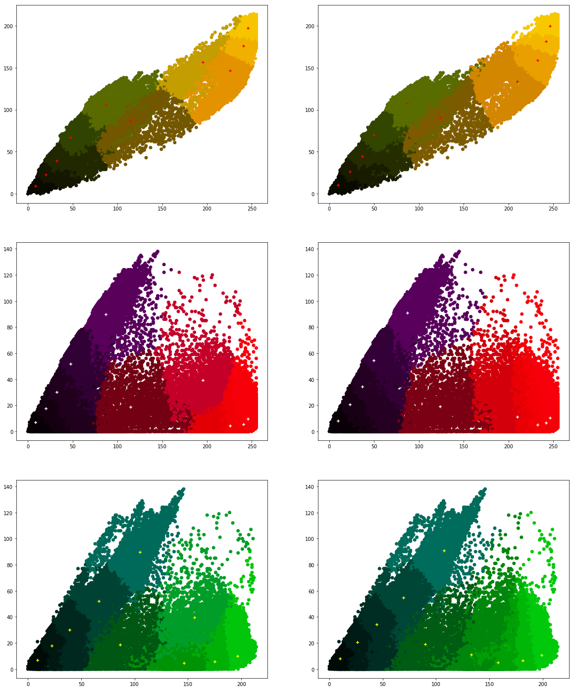

Quelles sont vos conclusions ?

